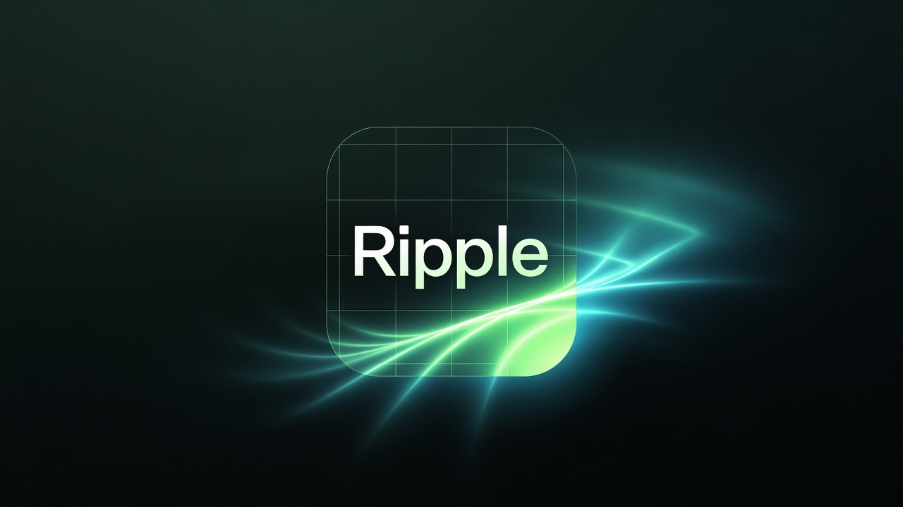
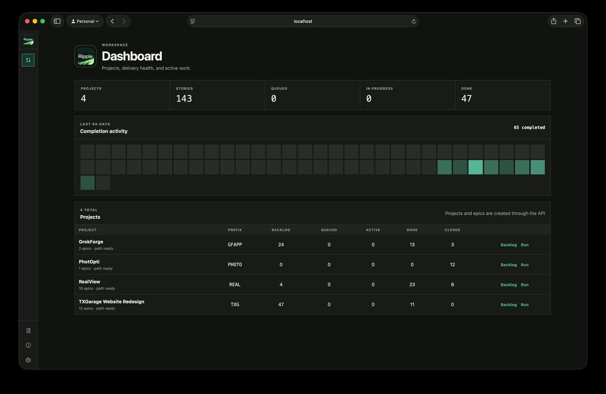
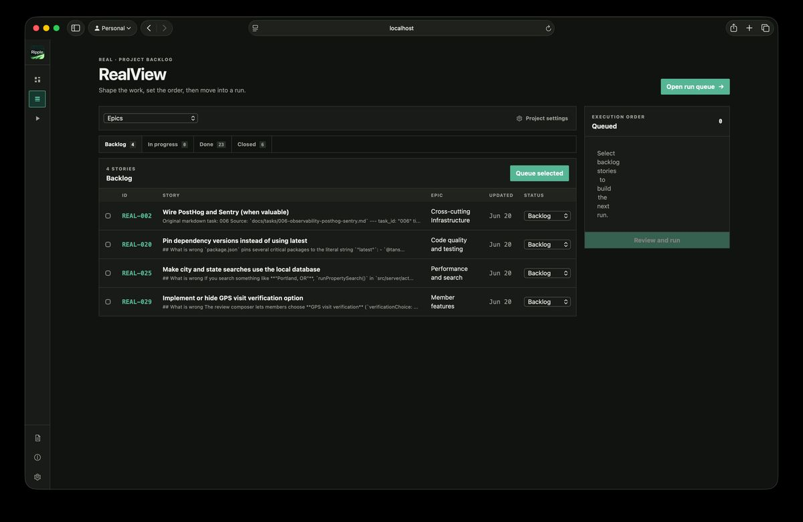
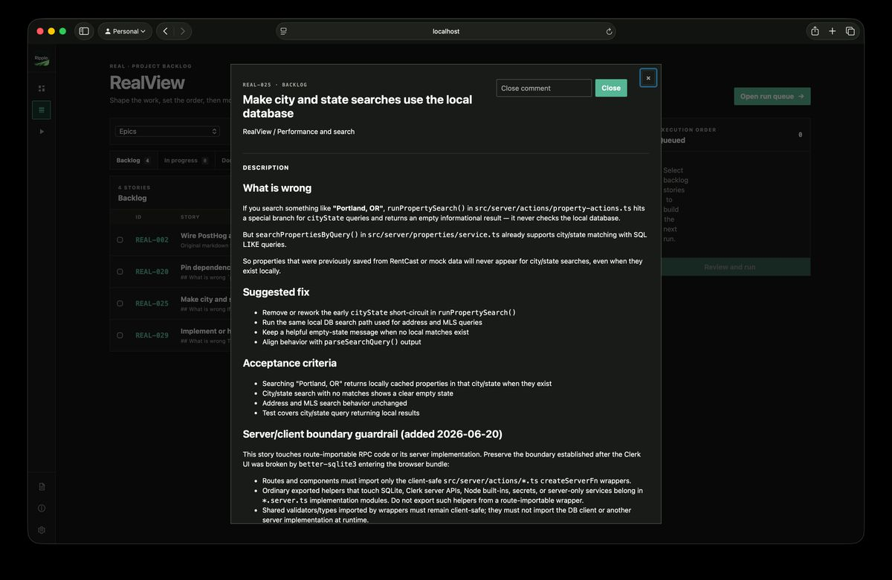
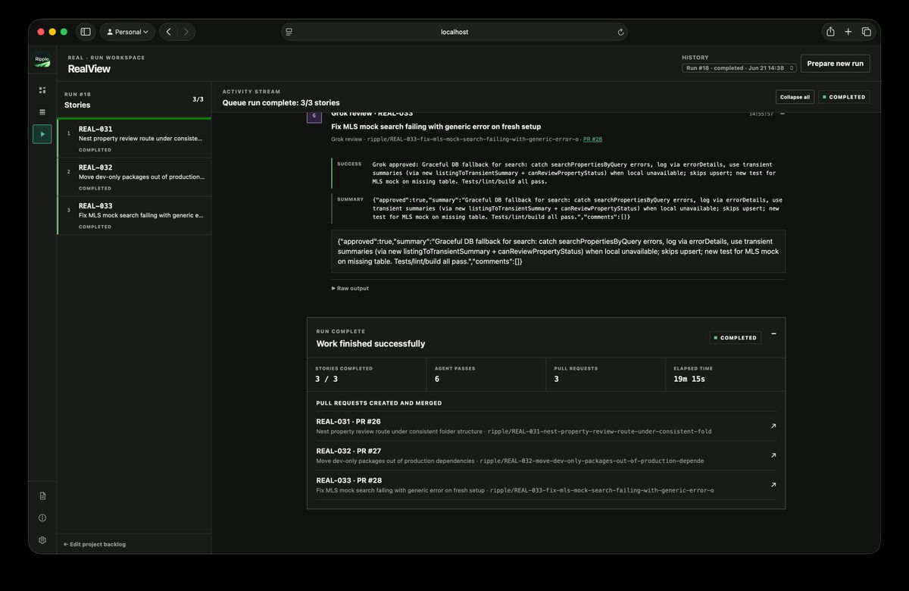
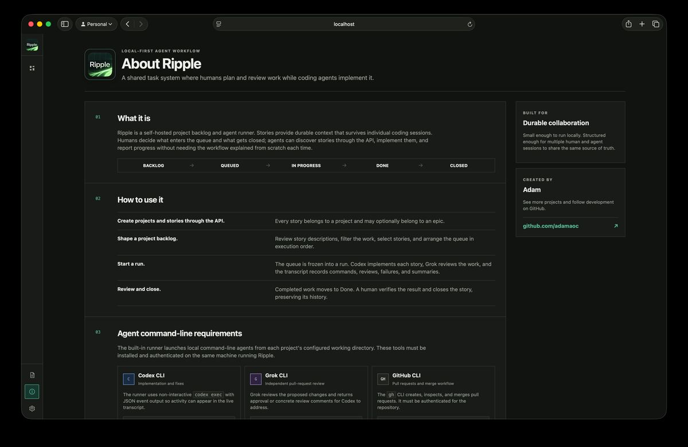

<div align="center">



# Ripple

**Autonomous agent runs for real software tasks.**

A local-first task manager and agent orchestrator. Humans shape the backlog. Agents implement, review, and merge the work. You keep the context and the final say.

[](https://go.dev/)
[](https://github.com/adamaoc/ripple/stargazers)
[](LICENSE)

[Quick start](#quick-start) · [How it works](#how-it-works) · [Autonomy](#autonomy-modes) · [Agents](#agent-settings) · [API](#api-first-by-design) · [Contributing](#contributing)

</div>



<div align="center"><sub>One local workspace for project health, backlogs, and agent delivery runs.</sub></div>

## Stop babysitting the agent

Most coding-agent workflows still make you supervise every command. Ripple gives agents a durable backlog and a complete delivery loop, so you can direct the work instead of micromanaging the session.

Queue one story or several. Ripple runs them in order and handles the machinery around each change:

```text
Create branch → Implement → Commit → Push → Open PR
      → Independent review → Address feedback → Quality gate → Merge
```

Every agent message, command, warning, review, and outcome stays visible in a structured run transcript. Automation does the work; transparency keeps it trustworthy.

## Features

- **Autonomous or supervised delivery** — Per-project: fully auto-merge, or stop at PR review for a human.
- **Configurable agents** — Settings binds an Implementer (CLI) and Reviewer (CLI or OpenAI-compatible API).
- **Built-in review loop** — Independent PR review before merge; one auto fix pass in autonomous mode.
- **Real delivery workflow** — Feature branches, commits, PRs, review comments, quality gates, and merges.
- **Human-controlled planning** — People decide what enters the queue and when completed work is closed.
- **Durable agent context** — Markdown stories, event history, epics, and prior-run summaries survive chat sessions.
- **Live, honest transcripts** — Follow agent activity in real time, with raw output retained for inspection.
- **Workspace setup checks** — Verify path, git, GitHub remote, and tool readiness before you run.
- **API-first task management** — Agents discover the workflow through JSON and OpenAPI endpoints.
- **Local-first by default** — One Go process, embedded UI, SQLite database you own.
- **Focused interface** — Responsive light and dark themes with no frontend build step.

## Product tour

<table>
<tr>
<td width="50%"><strong>Shape the backlog</strong><br><sub>Filter stories, choose the work, and define the exact execution order.</sub></td>
<td width="50%"><strong>Keep rich story context</strong><br><sub>Markdown descriptions, acceptance criteria, constraints, and history stay attached to the work.</sub></td>
</tr>
<tr>
<td></td>
<td></td>
</tr>
<tr>
<td><strong>Run the full delivery loop</strong><br><sub>Watch implementation and review passes, then inspect merged pull requests and run outcomes.</sub></td>
<td><strong>Onboard without guesswork</strong><br><sub>Built-in guidance explains the workflow, required tools, and human-agent responsibilities.</sub></td>
</tr>
<tr>
<td></td>
<td></td>
</tr>
</table>

## How it works

Ripple separates human decisions from agent execution:

1. **Create a project.** Use the dashboard form or the API. Point `workingDirectory` at a local Git repo (or clone from GitHub in project settings).
2. **Shape the backlog.** Enrich Markdown stories; set autonomy and delivery options on the project.
3. **Build the queue.** Select stories and place them in the exact order they should run.
4. **Verify setup.** Use **Verify setup** in project settings when something looks wrong.
5. **Start a run.** Ripple freezes the queue and processes each story on its own feature branch.
6. **Review.** The configured Reviewer inspects the PR. Autonomous mode may auto-fix once; supervised mode waits for you.
7. **Merge.** Quality gate runs, then the PR is merged (automatically or by you). **Done always means merged.**

### Story lifecycle

```text
backlog → queued → in_progress → in_review → done → closed
```

| Status | Meaning |
| --- | --- |
| `backlog` | Not queued |
| `queued` | Human ordered the story into a run |
| `in_progress` | Agent is implementing or addressing feedback |
| `in_review` | PR open; ball is with the human (supervised) |
| `done` | Pull request merged |
| `closed` | Human archived the story after review |

- **Agents** may set only `backlog`, `in_progress`, and `done` via the API.
- **`queued`**, **`in_review`**, and **`closed`** are human/orchestrator-only.
- Autonomous runs may never show `in_review` in the UI; they go to `done` after merge.

## Autonomy modes

Each project chooses how far automation may go:

| Mode | Behavior |
| --- | --- |
| **Autonomous** (default) | Implement → PR → agent review → optional one fix pass → quality gate → merge → `done` |
| **Supervised** | Implement → PR → agent review → stop at `in_review`. You act on comments, merge (with quality gate), or mark done if you already merged on GitHub |

While a story is `in_review`, the queue continues with later stories so human latency does not block the run.

On supervised stories in the story panel:

- **Act on review comments** — Agent applies PR feedback and pushes (no quality gate on this step)
- **Merge pull request** — Quality gate, then merge, then `done`
- **⋯ Fix merge conflicts** — Merge latest base into the feature branch and run the implementer to resolve conflict markers
- **⋯ I already merged on GitHub** — If you merged outside Ripple, verify that and mark the story done (does not merge again)

## Agent settings

Open **Settings → Agents** for app-wide tooling (not per project).

| Role | Who can fill it |
| --- | --- |
| **Implementer** | CLI only (Codex or Grok) — writes code and applies fix passes |
| **Reviewer** | Codex CLI, Grok CLI, **or** an OpenAI-compatible HTTP API provider |

Path precedence for CLI binaries:

```text
env override (RIPPLE_CODEX_BIN / RIPPLE_GROK_BIN) > Settings path > auto-detect
```

### API reviewers

Under **Settings → API providers** you can add an OpenAI-compatible chat/completions host (base URL, model, API key). Select it as Reviewer. Keys are stored in the local SQLite database, masked in the UI, and never written into run transcripts.

**v1 constraint:** API providers cannot be Implementers (they cannot edit files natively).

## Quick start

### 1. Run Ripple

Requirements for the app itself:

- [Go 1.24+](https://go.dev/doc/install)
- Git

```bash
git clone https://github.com/adamaoc/ripple.git
cd ripple
go run .
```

Open [http://localhost:8080](http://localhost:8080). Ripple creates `ripple.db` in the current directory on first launch.

### 2. Connect a project

**Option A — UI:** Dashboard → **Create project**, then open Project settings to set a path, verify setup, or clone from GitHub.

**Option B — API:**

```bash
curl -X POST http://localhost:8080/api/stories \
  -H 'Content-Type: application/json' \
  -d '{
    "projectId": "my-app",
    "projectName": "My App",
    "projectPrefix": "APP",
    "workingDirectory": "/absolute/path/to/my-app",
    "title": "Add keyboard navigation",
    "description": "Add keyboard navigation to the command menu.\n\n## Acceptance criteria\n- Arrow keys move focus\n- Enter selects an item\n- Existing pointer behavior remains unchanged"
  }'
```

`workingDirectory` should be a clean local Git repository with an accessible GitHub remote.

### 3. Enable agent runs

Install and authenticate tools on the same machine as Ripple:

| Tool | Role | Check |
| --- | --- | --- |
| [Codex CLI](https://developers.openai.com/codex/cli/) | Implementer (default) or Reviewer | `codex --version` |
| [Grok CLI](https://docs.x.ai/build/overview) | Reviewer (default) or Implementer | `grok --version` |
| [GitHub CLI](https://cli.github.com/) | PRs, comments, merges | `gh auth status` |

Optional: Settings → Agents for path overrides; Settings → API providers for an HTTP reviewer.

Then queue stories from the backlog, open the run workspace, and select **Start run**.

## API-first by design

Ripple is not only a UI for humans. Its API is deliberately self-describing so a coding agent can learn the workflow without a custom integration prompt.

Start at:

```http
GET /api
```

The discovery response links to:

```http
GET /api/docs
GET /api/openapi.yaml
```

Common operations include:

```bash
# List active stories
curl http://localhost:8080/api/stories

# Read one story and its history
curl http://localhost:8080/api/stories/APP-001
curl http://localhost:8080/api/stories/APP-001/events

# Tell Ripple implementation has begun
curl -X PATCH http://localhost:8080/api/stories/APP-001/status \
  -H 'Content-Type: application/json' \
  -d '{"status":"in_progress"}'
```

See [`docs/bot-api.md`](docs/bot-api.md) for the agent-oriented guide and [`docs/openapi.yaml`](docs/openapi.yaml) for the full contract.

## Deliberately compact architecture

Ripple is designed to be easy to understand, run, and contribute to:

| Layer | Choice |
| --- | --- |
| Application | Go standard-library HTTP server |
| Persistence | Embedded SQLite |
| UI | Server-rendered HTML templates + HTMX |
| Styling | Plain CSS with light and dark themes |
| Agent integration | Local CLI processes + optional OpenAI-compatible HTTP reviewer |
| API | JSON endpoints + embedded OpenAPI documentation |

Templates, static assets, migrations, API docs, and the application are compiled into one Go binary. There is no Node runtime, asset pipeline, container, or external database required for Ripple itself.

### Source map

```text
main.go                 HTTP server, storage, API, UI, run transcript
pipeline.go             Git, GitHub, review, merge, supervised actions
agents.go               AgentRunner interface, CLI + HTTP API runners
agent_config.go         Global provider registry and role binding
project_setup.go        Workspace setup checklist and clone helpers
templates/              Server-rendered interface
static/                 Styles and brand assets
docs/bot-api.md         Agent-readable workflow guide
docs/openapi.yaml       Machine-readable API contract
```

## Configuration

Flags override environment variables. Settings UI paths sit between env and auto-detect for agent binaries.

| Purpose | Flag | Environment variable | Default |
| --- | --- | --- | --- |
| Listen address | `-addr` | `RIPPLE_ADDR` | `:8080` |
| SQLite database | `-db` | `RIPPLE_DB` | `ripple.db` |
| Codex executable | — | `RIPPLE_CODEX_BIN` | Auto-detected / Settings |
| Grok executable | — | `RIPPLE_GROK_BIN` | Auto-detected / Settings |
| GitHub CLI executable | — | `RIPPLE_GH_BIN` | `gh` from `PATH` |

Examples:

```bash
go run . -addr :8090 -db ~/ripple/ripple.db

RIPPLE_ADDR=:8090 \
RIPPLE_DB=~/ripple/ripple.db \
RIPPLE_CODEX_BIN=/opt/homebrew/bin/codex \
go run .
```

Build a standalone executable with:

```bash
go build -o ripple .
./ripple
```

## Development

```bash
# Run the test suite
go test ./...

# Static analysis
go vet ./...

# Format Go sources
gofmt -w *.go

# Build everything
go build ./...
```

## Security and scope

Ripple is intended for a **trusted local development environment**. It has no user authentication or authorization layer. Queue runs execute local tools with access to configured project directories. API keys for reviewers are stored in SQLite **without at-rest encryption** (as protected as the machine and database file).

Do not expose Ripple directly to the public internet. Review a story's scope before queueing it, keep project repositories clean, and inspect completed runs before treating the result as released software.

Current intentional constraints:

- One agent activity at a time (queue runs and manual “act on feedback” share a global lock).
- Implementer is CLI-only (Codex or Grok); API integrations are reviewer-capable only. Either role may use the same CLI.
- Stories are archived by closing them rather than deleting history.
- GitHub is the supported pull-request provider.
- Done means merged — never on PR open alone.

## Contributing

Issues, ideas, and pull requests are welcome. For substantial changes, open an issue first so the product direction and implementation approach can be discussed before you invest deeply.

When submitting code:

1. Keep the local-first, low-dependency architecture intact.
2. Add or update tests for behavior changes.
3. Run `go test ./...` and `go vet ./...`.
4. Include screenshots for visible UI changes.

## License

Ripple is available under the [MIT License](LICENSE).

---

<div align="center">

Built by [Adam](https://github.com/adamaoc) for developers who would rather direct the work than babysit it.

</div>
