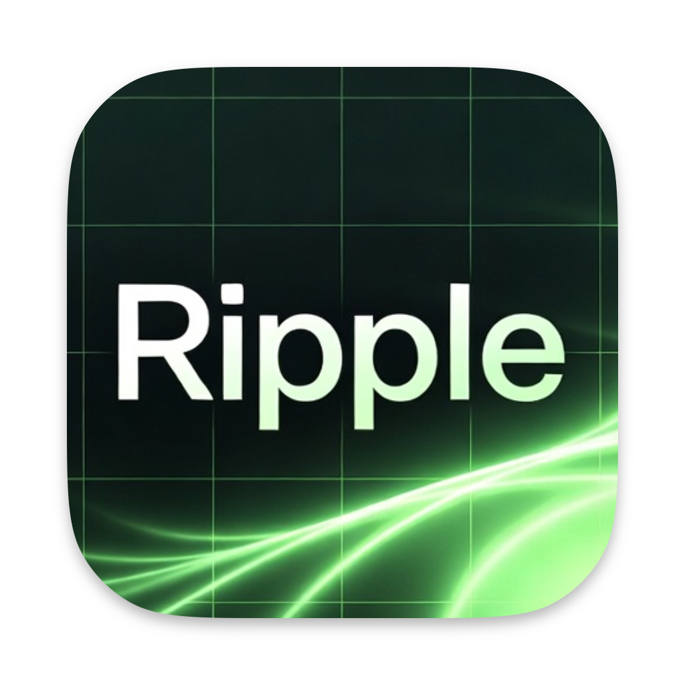
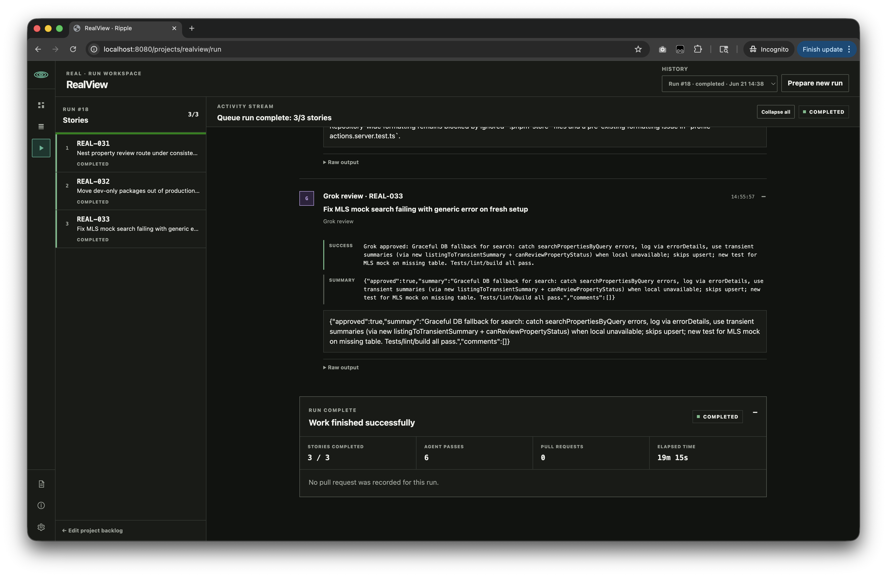

<div align="center">



# Ripple

**Autonomous agent runs for real software tasks.**

A local-first task manager and agent orchestrator. Humans shape the backlog. Agents implement, review, and merge the work. You keep the context and the final say.

[](https://go.dev/)
[](https://github.com/adamaoc/ripple/stargazers)
[](LICENSE)

[Quick start](#quick-start) · [How it works](#how-it-works) · [API](#api-first-by-design) · [Contributing](#contributing)

</div>



## Stop babysitting the agent

Most coding-agent workflows still make you supervise every command. Ripple gives agents a durable backlog and a complete delivery loop, so you can direct the work instead of micromanaging the session.

Queue one story or several. Ripple runs them in order and handles the machinery around each change:

```text
Create branch → Implement → Commit → Push → Open PR
      → Independent review → Address feedback → Quality gate → Merge
```

Every agent message, command, warning, review, and outcome stays visible in a structured run transcript. Automation does the work; transparency keeps it trustworthy.

## Features

- **Autonomous queue runs** — Execute an ordered set of stories from one action.
- **Built-in review loop** — Codex implements and Grok independently reviews each pull request.
- **Real delivery workflow** — Feature branches, commits, pull requests, review comments, quality gates, and merges are orchestrated for you.
- **Human-controlled planning** — People decide what enters the queue and when completed work is closed.
- **Durable agent context** — Markdown stories, event history, epics, and prior-run summaries survive individual chat sessions.
- **Live, honest transcripts** — Follow agent activity in real time, with raw output retained for deeper inspection.
- **Multi-project workspace** — Point projects at separate local Git repositories and manage them from one place.
- **API-first task management** — Agents can discover the workflow and manage work through JSON and OpenAPI endpoints.
- **Local-first by default** — One Go process, embedded UI, and a SQLite database you own.
- **Focused interface** — Responsive light and dark themes with no frontend build step.

## How it works

Ripple separates human decisions from agent execution:

1. **Shape the backlog.** Create or enrich stories through the API, then review their Markdown descriptions in the UI.
2. **Build the queue.** Select stories and place them in the exact order they should run.
3. **Start once.** Ripple snapshots the queue and processes each story on its own feature branch.
4. **Review automatically.** Grok reviews the pull-request diff. Actionable feedback triggers one Codex fix pass.
5. **Enforce quality.** Available test, lint, typecheck, and build scripts must pass before merge.
6. **Inspect the result.** The run workspace preserves the complete transcript, review summary, pull request, and outcome.

The story lifecycle stays simple:

```text
backlog → queued → in_progress → done → closed
```

Agents work within `backlog`, `in_progress`, and `done`. Queueing and closing remain human decisions.

## Quick start

### 1. Run Ripple

Requirements for the app itself:

- [Go 1.24+](https://go.dev/doc/install)
- Git

```bash
git clone https://github.com/adamaoc/ripple.git
cd ripple
go run .
```

Open [http://localhost:8080](http://localhost:8080). Ripple creates `ripple.db` in the current directory on first launch.

### 2. Connect a project

Create a project and its first story through the API. `workingDirectory` must point to a clean local Git repository with an accessible GitHub remote.

```bash
curl -X POST http://localhost:8080/api/stories \
  -H 'Content-Type: application/json' \
  -d '{
    "projectId": "my-app",
    "projectName": "My App",
    "projectPrefix": "APP",
    "workingDirectory": "/absolute/path/to/my-app",
    "title": "Add keyboard navigation",
    "description": "Add keyboard navigation to the command menu.\n\n## Acceptance criteria\n- Arrow keys move focus\n- Enter selects an item\n- Existing pointer behavior remains unchanged"
  }'
```

You can change the working directory later from the project backlog UI.

### 3. Enable autonomous runs

Ripple currently uses three local command-line tools:

| Tool | Role | Check |
| --- | --- | --- |
| [Codex CLI](https://developers.openai.com/codex/cli/) | Implementation and review fixes | `codex --version` |
| [Grok CLI](https://docs.x.ai/build/overview) | Independent pull-request review | `grok --version` |
| [GitHub CLI](https://cli.github.com/) | Pull requests, comments, and merges | `gh auth status` |

The tools must be installed and authenticated on the same machine as Ripple. Once they are ready, queue stories from the backlog, open the run workspace, and select **Start run**.

## API-first by design

Ripple is not only a UI for humans. Its API is deliberately self-describing so a coding agent can learn the workflow without a custom integration prompt.

Start at:

```http
GET /api
```

The discovery response links to:

```http
GET /api/docs
GET /api/openapi.yaml
```

Common operations include:

```bash
# List active stories
curl http://localhost:8080/api/stories

# Read one story and its history
curl http://localhost:8080/api/stories/APP-001
curl http://localhost:8080/api/stories/APP-001/events

# Tell Ripple implementation has begun
curl -X PATCH http://localhost:8080/api/stories/APP-001/status \
  -H 'Content-Type: application/json' \
  -d '{"status":"in_progress"}'
```

See [`docs/bot-api.md`](docs/bot-api.md) for the agent-oriented guide and [`docs/openapi.yaml`](docs/openapi.yaml) for the full contract.

## Deliberately compact architecture

Ripple is designed to be easy to understand, run, and contribute to:

| Layer | Choice |
| --- | --- |
| Application | Go standard-library HTTP server |
| Persistence | Embedded SQLite |
| UI | Server-rendered HTML templates + HTMX |
| Styling | Plain CSS with light and dark themes |
| Agent integration | Local CLI processes with structured output |
| API | JSON endpoints + embedded OpenAPI documentation |

Templates, static assets, migrations, API docs, and the application are compiled into one Go binary. There is no Node runtime, asset pipeline, container, or external database required for Ripple itself.

### Source map

```text
main.go                 HTTP server, storage, API, UI, run transcript
pipeline.go             Git, GitHub, Codex, Grok, review, and merge pipeline
main_test.go            Application and API tests
pipeline_test.go        Pipeline behavior tests
templates/              Server-rendered interface
static/                 Styles and brand assets
docs/bot-api.md         Agent-readable workflow guide
docs/openapi.yaml       Machine-readable API contract
```

## Configuration

Flags override environment variables.

| Purpose | Flag | Environment variable | Default |
| --- | --- | --- | --- |
| Listen address | `-addr` | `RIPPLE_ADDR` | `:8080` |
| SQLite database | `-db` | `RIPPLE_DB` | `ripple.db` |
| Codex executable | — | `RIPPLE_CODEX_BIN` | Auto-detected |
| Grok executable | — | `RIPPLE_GROK_BIN` | Auto-detected |
| GitHub CLI executable | — | `RIPPLE_GH_BIN` | `gh` from `PATH` |

Examples:

```bash
go run . -addr :8090 -db ~/ripple/ripple.db

RIPPLE_ADDR=:8090 \
RIPPLE_DB=~/ripple/ripple.db \
RIPPLE_CODEX_BIN=/opt/homebrew/bin/codex \
go run .
```

Build a standalone executable with:

```bash
go build -o ripple .
./ripple
```

## Development

```bash
# Run the test suite
go test ./...

# Static analysis
go vet ./...

# Format Go sources
gofmt -w main.go main_test.go pipeline.go pipeline_test.go

# Build everything
go build ./...
```

## Security and scope

Ripple is intended for a trusted local development environment. It currently has no user authentication or authorization layer, and autonomous runs execute local tools with access to configured project directories.

Do not expose Ripple directly to the public internet. Review a story's scope before queueing it, keep project repositories clean, and inspect completed runs before treating the result as released software.

Current intentional constraints:

- One autonomous queue run executes at a time.
- Projects and epics are created through the API; their work is managed in the UI.
- Stories are archived by closing them rather than deleting history.
- GitHub is the supported pull-request provider.
- Codex and Grok are the supported implementation/review pair today.

## Contributing

Issues, ideas, and pull requests are welcome. For substantial changes, open an issue first so the product direction and implementation approach can be discussed before you invest deeply.

When submitting code:

1. Keep the local-first, low-dependency architecture intact.
2. Add or update tests for behavior changes.
3. Run `go test ./...` and `go vet ./...`.
4. Include screenshots for visible UI changes.

## License

Ripple is available under the [MIT License](LICENSE).

---

<div align="center">

Built by [Adam](https://github.com/adamaoc) for developers who would rather direct the work than babysit it.

</div>
